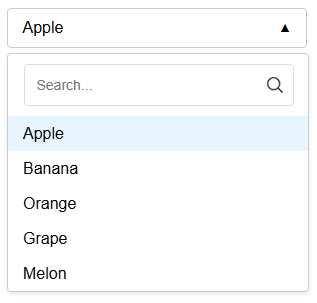
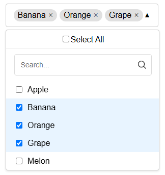

# Custom Dropdown Component

A highly performant, customizable dropdown menu component built with React, featuring virtualization for large datasets and multiple selection modes.




## Features

**Core Functionality**
- Single & Multi-select modes
- Search/filter functionality with clear button
- Dynamic "Select All/Deselect All" in multi-select mode
- Customizable styling with CSS
- Click-outside closing behavior
- Responsive design

**Large List Handling**
- Virtualized scrolling using `react-window`
- Memoized row components for optimal rendering
- Loading indicator for large datasets (>1000 items)
- Efficient search filtering with memoization

**UX Enhancements**
- Clear search input button
- Animated chevron icon
- Smooth transitions

## Installation

1. Clone the repository:
```bash
git clone https://github.com/Tanmay-Deshmukh/Hive-Frontend-Engineer-Challenge
```
2. Install dependencies:
```bash
cd ./Hive-Frontend-Engineer-Challenge
npm install
```
3. Start the development server:
```bash
npm start
```

## Usage
```jsx
import Dropdown from './components/Dropdown';

const options = [
  { value: '1', label: 'Option 1' },
  { value: '2', label: 'Option 2' },
  // ... more options
];

// Single Select
<Dropdown
  options={options}
  value={selectedValue}
  onChange={handleChange}
  placeholder="Select an option"
/>

// Multi Select
<Dropdown
  options={options}
  value={selectedValues}
  onChange={handleMultiChange}
  isMulti={true}
  placeholder="Select multiple options"
/>
```

### Component Props

| Prop          | Type                            | Default       | Description                              |
|---------------|---------------------------------|---------------|------------------------------------------|
| `options`     | `Array<{value, label}>`        | **Required**  | Available options                       |
| `value`       | `any` \| `Array<any>`          | —             | Currently selected value(s)             |
| `onChange`    | `(value: any) => void`         | **Required**  | Handler for selection changes           |
| `isMulti`     | `boolean`                      | `false`       | Enable multiple selection mode          |
| `placeholder` | `string`                       | `'Select...'` | Text displayed when no option is selected |

## Technologies Used
- React 18+
- `react-window` (Virtualization)
- `PropTypes` (Type checking)
- CSS (Styling)
- SVG (Icons)

## Author
Tanmay Deshmukh